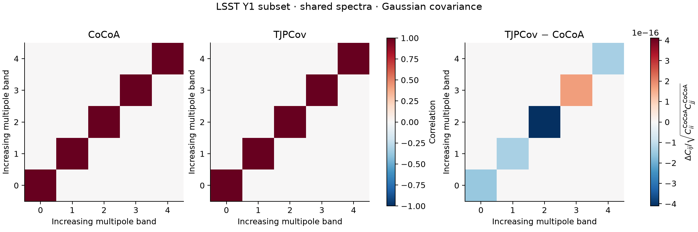
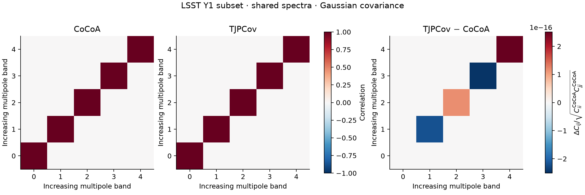
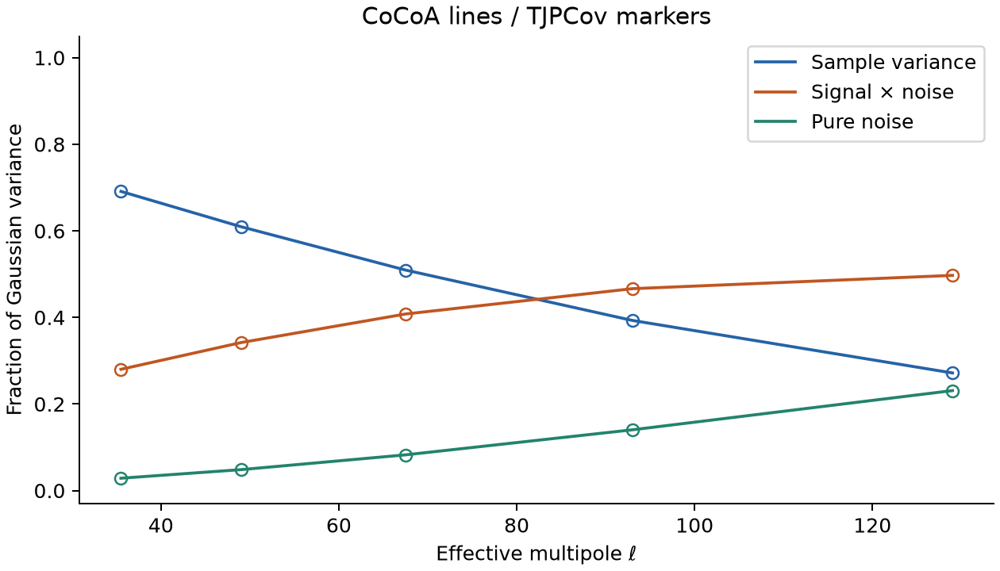
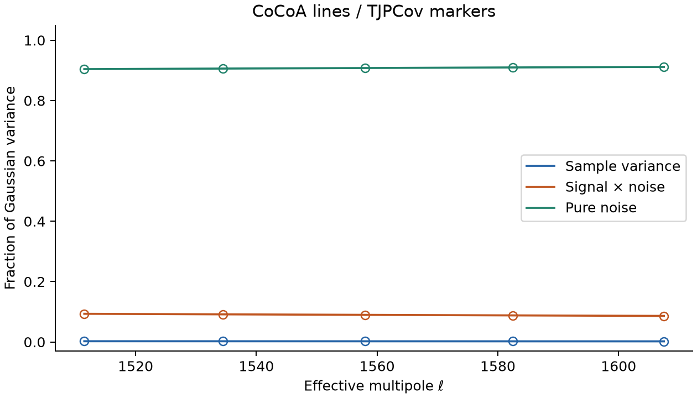
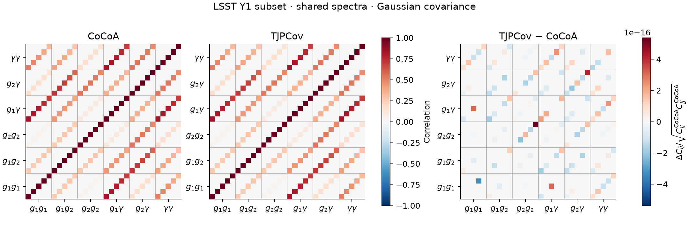
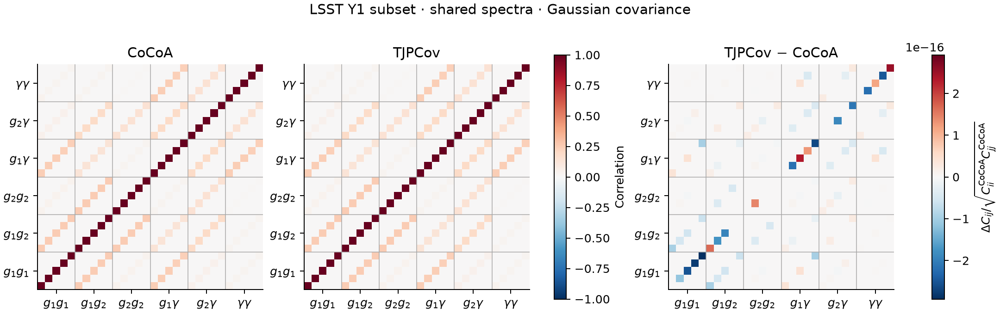
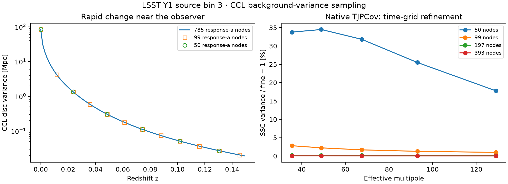
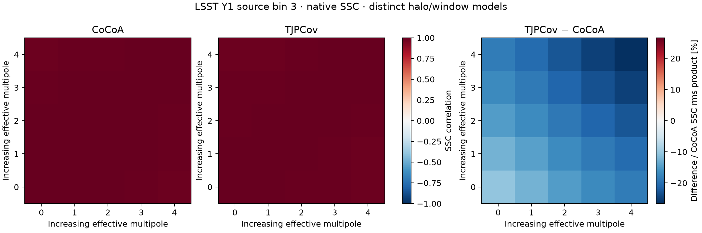
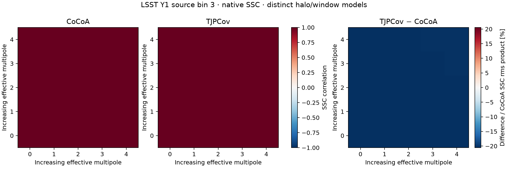
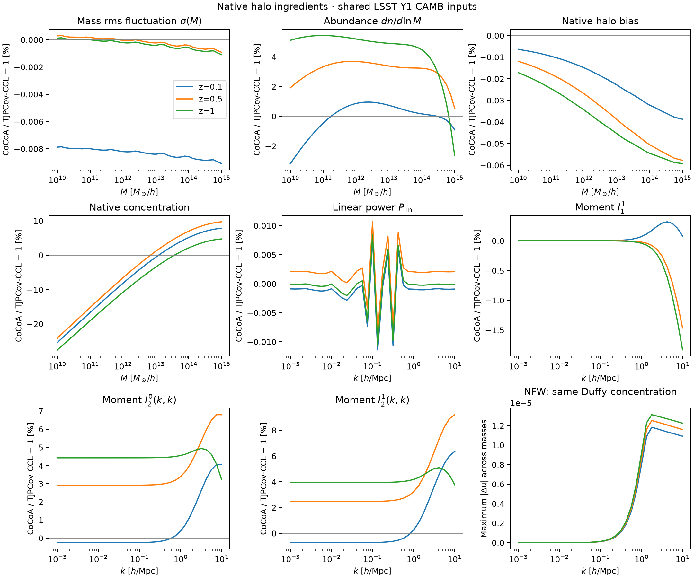

# CoCoA vs TJPCov: covariance comparison

This repository compares [CoCoA/CosmoLike](https://github.com/CosmoLike/cocoa)
with [TJPCov](https://github.com/LSSTDESC/TJPCov), the LSST DESC covariance
code. **LSST Y1 is the benchmark survey.**

We follow the component comparisons of
[CoCoA vs OneCovariance](https://github.com/vivianmiranda/OneCov-benchmark-):
Gaussian covariance, super-sample covariance (SSC), halo ingredients,
separate halo trispectra, and connected non-Gaussian covariance (cNG).
Complete matrix comparisons retain all entries and show Gaussian, SSC,
cNG and total differences separately.

**Status:** the low- and high-multipole Gaussian comparisons, including
30 × 30 galaxy-and-shear matrices, pass at floating-point precision with
shared spectra and bin weights. The isolated environment is installed and
tested. Small native SSC comparisons and their sampling diagnostics are
also complete. The first native halo-ingredient comparisons are measured
below. Separated trispectra and cNG remain pending; timings come last.

## Contents

1. [Comparison scope](#scope)
2. [Physical choices](#physics)
3. [Installation and compilation](#installation)
4. [Starting and stopping](#sessions)
5. [CoCoA environment](#cocoa-environment)
6. [First Gaussian comparison](#gaussian)
7. [Gaussian results](#results)
8. [Super-sample covariance](#ssc)
9. [Halo ingredients](#halo)

## Comparison scope <a name="scope"></a>

The source study uses TJPCov revision
[`2f59302`](https://github.com/LSSTDESC/TJPCov/tree/2f59302af33607aec712185632d8274e59e6b33c).
TJPCov uses CCL for angular spectra and halo-model calculations, and SACC
to describe the survey tracers and the ordering of measured quantities.

| Comparison | TJPCov calculation | Initial scope |
| --- | --- | --- |
| Gaussian Fourier covariance | `FourierGaussianFsky` | One source bin; then two lens bins and one source bin. |
| SSC | `FourierSSCHaloModelFsky` | Background variance, matter response and projected shear covariance. |
| Halo ingredients | CCL routines called by TJPCov | Mass variance, abundance, bias, concentration and halo moments. |
| 1h, 2h, 3h, 4h trispectra | CCL routines called by `FouriercNGHaloModelFsky` | Equal and unequal wavenumbers at several redshifts. |
| cNG | `FouriercNGHaloModelFsky` | Shared-trispectrum projection and native halo-model results. |
| Complete Fourier matrix | Sum of the three Fourier components | One source bin, with all off-diagonal entries. |
| Real-space covariance | `RealGaussianFsky` | One source bin's xi+ and xi−, including their cross-covariance. |

TJPCov's public real-space calculator supplies **Gaussian covariance**.
It currently projects the EE block only. The source study therefore
requires a separate check of shear-noise contributions before a total
real-space Gaussian agreement claim. Native real-space SSC and cNG are
not exposed by the studied checkout.

Mask-coupled Gaussian covariance through NaMaster is a separate TJPCov
capability. The first comparison uses the common sky-fraction
approximation; the installation below does not include NaMaster or MPI.

## Physical choices <a name="physics"></a>

Start with the same LSST Y1 redshift distributions, survey area, number
densities, shape noise and CAMB tables used in the OneCovariance study.
The exporter reads the actual LSST project configuration and preserves
the selected bin's identity and original redshift samples.
The initial comparison uses massless neutrinos and zero intrinsic
alignment, magnification and redshift-space distortions.

Shared inputs isolate an individual calculation. Native-model results
then show the combined effect of each code's physical choices. These
are reported separately.

- **CoCoA:** the galaxy covariance uses linear-bias matter projections.
  The CoCoA baseline selected for this study includes the low-mass Wynn
  treatment in I11;
  higher halo moments use direct integrals.
- **TJPCov:** the connected galaxy covariance uses HOD profiles in the
  one-halo term, and bias-weighted matter terms at higher halo order.
  Cosmic shear avoids this galaxy-model mismatch in the first cNG test.

The native halo prescriptions also differ:

- **CoCoA:** Tinker (2010) multiplicity and bias, with its bias-consistency
  normalization, and the Bhattacharya (2013) concentration prescription.
- **TJPCov:** Tinker (2008) abundance, Tinker (2010) bias, Duffy (2008)
  concentration and NFW profiles, as selected in its SSC and cNG classes.

Equal sky area alone does not match the SSC window:

- **CoCoA:** the survey examples use a spherical-cap footprint.
- **TJPCov:** its sky-fraction SSC calculator calls CCL's circular-disc
  background variance.

These are modeling differences to measure, not evidence of a numerical
error. Numerical refinements must be checked within each code first.

## Installation and compilation <a name="installation"></a>

We assume Conda is installed and `TJPCov/` and `tjcovbenchmark/` are sibling
directories. Open a fresh Bash terminal in `tjcovbenchmark/`. Keep the
CoCoA environment in a separate terminal.

This follows the Cocoa setup/compile/start/stop sequence. Conda supplies
CCL and its compiled dependencies; the repository-private `.local`
environment contains the pinned TJPCov installation.

**Step :one:**: create the separate Conda base.

```bash
conda env create --file=environment.yml
```

**Step :two:**: activate that base.

```bash
conda activate tjcovbenchmark
```

**Step :three:**: inspect
[set_installation_options.sh](set_installation_options.sh) for the local
TJPCov path and revision.

**Step :four:**: create the private environment.

```bash
source setup_tjpcov.sh
```

**Step :five:**: install the local source and check calculator imports.

```bash
source compile_tjpcov.sh
```

**Step :six:**: activate the private environment.

```bash
source start_tjpcov.sh
```

| File | Purpose |
| --- | --- |
| [environment.yml](environment.yml) | Create the separate Conda base, including CCL 3.3.3. |
| [set_installation_options.sh](set_installation_options.sh) | Select the existing TJPCov source path and revision. |
| [setup_tjpcov.sh](setup_tjpcov.sh) | Create `.local` using the active Conda base. |
| [compile_tjpcov.sh](compile_tjpcov.sh) | Install TJPCov offline and check its calculator imports. |
| [start_tjpcov.sh](start_tjpcov.sh) | Activate `.local`. |
| [stop_tjpcov.sh](stop_tjpcov.sh) | Restore the shell's previous Python environment. |

TJPCov itself is Python; the compile step installs it without rebuilding
CCL or changing Cocoa. The recipe pins Python, CCL and the principal
numerical packages. The tested macOS ARM environment is recorded in
[the resolved Conda export](results/environment/conda-osx-arm64.yml) and
[Python package versions](results/environment/python-packages.txt).
The portable recipe above remains the starting point on other platforms.

## Starting and stopping <a name="sessions"></a>

After installation, open a fresh Bash terminal in `tjcovbenchmark/`.
Setup and compilation are not needed for each calculation.

**Step :one:**: activate the Conda base.

```bash
conda activate tjcovbenchmark
```

**Step :two:**: activate the private environment.

```bash
source start_tjpcov.sh
```

**Step :three:**: after the calculation, leave the private environment.

```bash
source stop_tjpcov.sh
```

## CoCoA environment <a name="cocoa-environment"></a>

Use the [main Cocoa installation recipe](https://github.com/CosmoLike/cocoa#required_packages_conda)
and the [LSST Y1 covariance instructions](https://github.com/CosmoLike/cocoa_lsst_y1#computing_covariances).
The LSST Y1 interface must be compiled with covariance support enabled.

We assume Cocoa is already installed. Open a **separate** Bash terminal
in its `Cocoa/` directory. Replace `cocoa` below if the installed Conda
base has a different name.

**Step :one:**: activate Cocoa's Conda base.

```bash
conda activate cocoa
```

**Step :two:**: load Cocoa's runtime environment.

```bash
source start_cocoa.sh
```

**Step :three:**: select the benchmark's OpenMP thread count.

```bash
export OMP_NUM_THREADS=6
```

**Step :four:**: after the calculation, leave Cocoa's runtime environment.

```bash
source stop_cocoa.sh
```

## First Gaussian comparison <a name="gaussian"></a>

The first case uses **LSST Y1 source bin 3**, five Fourier bands
over `30 <= ell < 150`, and its complete 5 × 5 Gaussian covariance.
The source density and ellipticity noise come from the project settings.

This first test asks whether the two codes assemble the same covariance
from the same angular spectra:

- **TJPCov:** reads the LSST distribution through SACC and imports CoCoA's
  CAMB power tables through CCL. Its native Gaussian calculator computes
  the shear spectrum and covariance. The runner exports those same CCL
  spectrum samples and the bin operator used by TJPCov.
- **CoCoA:** receives the exported spectra, noise and operator through
  its production covariance interface. Its C kernels compute the matrix.

TJPCov's bin weights are proportional to `ell` on this integer grid.
The scripts check its reconstructed edges and match those weights in
CoCoA. The final endpoint is present to define the last edge and has zero
weight in the covariance. SACC's stored mean values are not used as
supplied spectra by this TJPCov calculator.

Sample variance, signal–noise and pure-noise pieces are saved separately.
TJPCov does not expose that split directly: three public calls with noise
power multiplied by zero, one and two recover the coefficients of its
quadratic dependence on noise. CoCoA obtains the same pieces by turning
the supplied signal or noise off.

This isolates **Gaussian assembly**. It does not compare native spectra,
validate the halo model, or generate SSC/cNG. CCL uses the supplied CAMB
power but its own background and interpolation; a later native-spectrum
comparison must measure those differences. The three noise calls also
do not constitute a production timing measurement.

### Run the prepared case

These commands assume the sibling directory layout described above.
Finish each step before starting the next; use the two activated terminals
from the environment instructions. Use new output names for a new case.

**Step :one:**: in the **CoCoA terminal**, from `cocoa/Cocoa/`, export the
actual survey inputs and CAMB tables. This does not compute a covariance.

```bash
python ../../tjcovbenchmark/scripts/export_lsst_y1.py \
  --cocoa . --output ../../tjcovbenchmark/work/lsst_y1
```

**Step :two:**: in the **TJPCov terminal**, from `tjcovbenchmark/`, select
the OpenMP allocation.

```bash
export OMP_NUM_THREADS=6
```

**Step :three:**: keep the numerical-array library single-threaded in
that terminal.

```bash
export OPENBLAS_NUM_THREADS=1
```

**Step :four:**: compute TJPCov's native Gaussian components and export
the angular spectra it uses.

```bash
python scripts/run_gaussian.py work/lsst_y1 --tjpcov ../TJPCov \
  --output work/gaussian_low
```

**Step :five:**: return to the **CoCoA terminal**, still in `cocoa/Cocoa/`,
and compare its Gaussian matrix using those exact arrays.

```bash
python ../../tjcovbenchmark/scripts/compare_gaussian.py \
  ../../tjcovbenchmark/work/gaussian_low --cocoa . \
  --output ../../tjcovbenchmark/work/comparison_low
```

**Step :six:**: in the **TJPCov terminal**, plot the passing comparison.

```bash
python scripts/plot_gaussian.py work/comparison_low \
  --output figures/gaussian_low
```

The matrix figure shows each code's correlations and the signed
TJPCov-minus-CoCoA difference, normalized by CoCoA's total rms product.
A second figure separates the three Gaussian variance contributions.
Every matrix entry is retained; the report also checks positivity and
generalized variance ratios. No eigenvalues are clipped.

For the matching high-multipole case, use `--ell-range 1500 1620` in
Step 4 and fresh output paths in Steps 4–6. Reuse the exported LSST bundle;
the runners verify its hashes before using it.

To include **lens bins 1 and 2**, add `--include-lenses` to Step 4.
This keeps all six measured spectra: the three clustering pairs, both
galaxy–shear pairs and the shear spectrum. Five bands per spectrum give
a complete 30 × 30 matrix. Use fresh run, comparison and figure paths.
The same three public noise settings separate all Gaussian components.

| Script | Purpose |
| --- | --- |
| [export_lsst_y1.py](scripts/export_lsst_y1.py) | Save the project's actual catalog, noise, cosmology and CAMB arrays. |
| [run_gaussian.py](scripts/run_gaussian.py) | Run native TJPCov shear Gaussian blocks and export the shared spectra/operator. |
| [compare_gaussian.py](scripts/compare_gaussian.py) | Call CoCoA's production C kernels and compare all Gaussian entries. |
| [plot_gaussian.py](scripts/plot_gaussian.py) | Make correlation, residual and variance-component panels in the OneCov comparison style. |

Manifests record the input hashes, survey identities, units, code
revisions, installed TJPCov source hashes and package versions. The low- and high-multipole workflows have both been executed in the
separate environments, including the native operator and noise-unit checks.

## Gaussian results <a name="results"></a>

### Shared-spectrum Gaussian covariance

**LSST Y1 source bin 3, five bands per case.** Both codes receive the
same angular spectra, shape-noise power and discrete band weights.
Every entry of each 5 × 5 matrix is compared. Differences below are
normalized by the CoCoA total Gaussian rms product, including for the
individual components.

| Component | Low multipoles, 30–149 | High multipoles, 1500–1619 |
| --- | ---: | ---: |
| Sample variance | 1.33e−16 | 8.42e−19 |
| Signal × noise | 3.44e−16 | 6.58e−16 |
| Pure noise | 1.81e−16 | 4.38e−16 |
| Total Gaussian | 1.72e−16 | 2.51e−16 |

Both totals are positive definite. Their generalized variance ratios
differ from one by at most 3.34e−16: the two Gaussian assembly routines
agree to floating-point precision for these cases. The largest fractional
difference on a nonzero individual component is 7.2e−15.

The nonoverlapping Fourier bands give diagonal matrices in this
sky-fraction approximation. The small residual panels magnify rounding
differences; they are not physical discrepancies.





The variance budget changes substantially between the cases. Signal
matters at low multipoles, while shape noise supplies about 90% of the
high-multipole variance. CoCoA lines and TJPCov markers overlap for all
three contributions.





These are **assembly tests**, not a comparison of independently generated
CoCoA and CCL spectra. They do not establish SSC/cNG agreement or full-survey
convergence. No performance claim is made from these correctness runs.

The [low-multipole report](results/gaussian_low/comparison.json) and
[high-multipole report](results/gaussian_high/comparison.json) contain the
checks, code revisions and input hashes. Each result directory includes
the component matrices, supplied spectra, band operators and native SACC
file. TJPCov is revision `2f59302`, using CCL 3.3.3; CoCoA includes the
committed Wynn/FFTLog implementation `d95867f`.

### Galaxy-and-shear matrices

Adding the two lens bins tests correlations between different observables,
including cross-lens clustering. These off-diagonal blocks are retained.
The maximum differences use the same total-Gaussian rms normalization as
above.

| Component | Low multipoles, 30 × 30 | High multipoles, 30 × 30 |
| --- | ---: | ---: |
| Sample variance | 3.89e−16 | 3.33e−16 |
| Signal × noise | 6.96e−16 | 6.58e−16 |
| Pure noise | 3.35e−16 | 4.51e−16 |
| Total Gaussian | 5.38e−16 | 2.76e−16 |

Both totals are positive definite, and generalized variance ratios differ
from one by at most 5.11e−15. Noise extraction subtracts nearly equal
matrices; fractional errors on very small noise entries are consequently
larger than the rms-normalized differences shown here.





The [low-multipole record](results/gaussian_3x2_low/comparison.json) and
[high-multipole record](results/gaussian_3x2_high/comparison.json) include
all component checks. Their variance budgets are shown in the
[low-multipole plot](figures/gaussian_3x2_low/gaussian_components.png) and
[high-multipole plot](figures/gaussian_3x2_high/gaussian_components.png).

## Super-sample covariance <a name="ssc"></a>

SSC describes how matter fluctuations larger than the footprint change
our measured spectra. A long-wavelength overdensity changes the local
matter power; multiplying the responses of two spectra and integrating
over the foreground matter produces their covariance.

These tests retain **all entries of a 5 × 5 shear SSC matrix** for source
bin 3. They use the effective multipoles of the low/high Gaussian cases.
They are point-sampled SSC calculations: TJPCov's native SSC evaluates
band centers, whereas its Gaussian calculator averages the bands. We do
not combine them into an implicitly band-averaged total.

### First check the sampling

The initial TJPCov time grid was not sufficiently resolved for this case.
Its circular-disc background variance rises sharply near the observer.
The sampled values agree at shared nodes, but a coarse grid does not
adequately describe the variation between them for the SSC projection.

A diagnostic using **the same public CCL halo and projection functions**
reproduces the native TJPCov matrix exactly, then changes one input grid
at a time:

| Change from the initial grid | Largest SSC change / initial SSC rms product |
| --- | ---: |
| Refine only matter-response time samples | 0.00311% |
| Refine only background-variance time samples | 23.9959% |
| Refine both time grids | 23.9963% |

Thus the large effect is localized to **background-variance sampling**.
It is not a 24% disagreement between halo prescriptions or between codes.
Doubling wavenumber sampling instead changes entries by only 0.0000735%
of the finer matrix's SSC rms product.

The native refinement below doubles the intervals in both CCL time-grid
segments, retaining the original nodes. Counts refer to the full response
grid; TJPCov uses its source-overlap subset for the background variance.
The normalization in this next table uses each **finer** matrix's SSC rms product,
which explains why its first percentage differs from the table above.

| CCL time-grid nodes, coarse → fine | Low-multipole SSC change |
| --- | ---: |
| 50 → 99 | 31.57% |
| 99 → 197 | 2.618% |
| 197 → 393 | 0.1574% |
| 393 → 785 | 0.0180% |

At high multipoles, 393 → 785 nodes changes entries by **0.000496%**.
At 393 nodes, switching the low-multipole projection from `qag_quad` to
`spline` changes entries by **0.000510%**. This tests the projection and
time sampling; it does not establish convergence of every halo ingredient.



Markers on the left show values evaluated by CCL. The fine curve joins
evaluated samples; it does not reconstruct the internal interpolation.
The disc variance shown has units of length before the radial projection.
The right panel shows the resulting native SSC variances relative to the
785-node result.

CoCoA's low-multipole quadrature checks give **0.0565%** for integration
level 0 → 1 and **0.0457%** for 1 → 2. At level 2, increasing its global
boost from 1 to 2 changes entries by **0.00589%**. These component checks
are adequate to distinguish the much larger differences below; they are
not a full-survey or Fisher-convergence certification.

### Native model comparison after refinement

Both codes receive the same CAMB power tables and source distribution.
Each retains its own halo response and footprint calculation:

- **CoCoA:** the fitted Tinker (2010) multiplicity and bias, Bhattacharya
  concentration, the guarded Wynn treatment of I11, a response based on
  the two-halo power slope and transferred to nonlinear power, and a
  spherical-cap footprint.
- **TJPCov:** Tinker (2008) abundance, Tinker (2010) bias, Duffy
  concentration, CCL's linear-power slope/amplitude plus the I12 response,
  and circular-disc background variance.

The CoCoA component is evaluated directly at the requested multipoles,
using its production C interface. Its full survey assembler additionally
interpolates in multipole. CCL retains its native background and tracer
interpolation. The remaining difference therefore combines several
choices; individual ingredient tests are needed to attribute it.

The following uses CoCoA boost 2/integration level 2 and the 785-node
CCL time grid. Positive values would mean TJPCov exceeds CoCoA; the
measured diagonal differences here are negative.

| SSC comparison | Low multipoles | High multipoles |
| --- | ---: | ---: |
| TJPCov diagonal relative to CoCoA | −10.48% to −26.62% | −20.55% to −20.34% |
| Largest absolute entry difference / CoCoA SSC rms product | 26.62% | 20.55% |





The refined matrices have positive symmetric parts. The high-multipole
SSC component is nearly rank deficient: nearby modes respond almost the
same way to the background. The coarse TJPCov result had a tiny negative
mode, which is retained in the archive; it disappears with refinement.
No eigenvalues are clipped. SSC-only weak-mode ratios are sensitive here
and must not be interpreted as a result for G + SSC + cNG.

The [SSC record](results/ssc_native.json) and
[array archive](results/ssc_native.npz) retain 19 native calculations,
the four sampling diagnostics, complete matrices and source provenance.
Their units are recorded explicitly. Timings are excluded from this
accuracy campaign.

### Reproduce the SSC comparison

First complete the Gaussian input export and native low/high cases above.
Keep the same two activated terminals and thread allocation.

**Step :one:**: in the **TJPCov terminal**, compute the coarse baseline.

```bash
python scripts/run_ssc.py work/lsst_y1 work/gaussian_low \
  --tjpcov ../TJPCov --match-power-a-range --output work/ssc_low_qag
```

The explicit domain flag sets CCL's lowest response scale factor to the
CAMB table boundary, rather than requesting power at earlier times not
supplied by that table. It preserves the full source-redshift support.
This changes a public CCL setting; neither TJPCov nor CCL source is patched.

**Step :two:**: compute the refined native matrix.

```bash
python scripts/run_ssc.py work/lsst_y1 work/gaussian_low \
  --tjpcov ../TJPCov --match-power-a-range --a-refinement 16 \
  --output work/ssc_low_a16
```

**Step :three:**: save the first refinement for the sampling diagnostic.

```bash
python scripts/run_ssc.py work/lsst_y1 work/gaussian_low \
  --tjpcov ../TJPCov --match-power-a-range --a-refinement 2 \
  --output work/ssc_low_a2
```

**Step :four:**: separate the response-grid and variance-grid effects.

```bash
python scripts/diagnose_ssc_sampling.py work/lsst_y1 work/gaussian_low \
  work/ssc_low_qag work/ssc_low_a2 --tjpcov ../TJPCov \
  --output work/ssc_sampling_a2
```

**Step :five:**: in the **CoCoA terminal**, from `cocoa/Cocoa/`, evaluate
its native response and spherical-cap projection at the same multipoles.

```bash
python ../../tjcovbenchmark/scripts/run_cocoa_ssc.py \
  ../../tjcovbenchmark/work/lsst_y1 ../../tjcovbenchmark/work/gaussian_low \
  --cocoa . --accuracy-boost 2 --integration-accuracy 2 \
  --output ../../tjcovbenchmark/work/cocoa_ssc_low_ab2_i2
```

**Step :six:**: in the **TJPCov terminal**, compare and plot all entries.

```bash
python scripts/compare_ssc.py work/cocoa_ssc_low_ab2_i2 work/ssc_low_a16 \
  --output work/ssc_comparison_low_refined --figures figures/ssc_low_refined
```

For high multipoles, use `work/gaussian_high` and new output paths.
For the refinement table, repeat Step 2 with factors 1, 2, 4, 8 and 16.
`--k-refinement 2` tests k-grid density; `--integration-method spline`
tests the projection method separately. Repeat the CoCoA step at boosts
1/2 and integration levels 0/1/2 to check its own numerical controls.

## Halo ingredients <a name="halo"></a>

The halo model combines the abundance of halos, their clustering bias and
how matter is distributed inside each halo. Comparing these ingredients
helps explain a covariance difference before it is integrated along the
line of sight.

This pilot samples redshifts 0.1, 0.5 and 1, masses from 10 billion to
one quadrillion solar masses/h, and wavenumbers from 0.001 to 10 h/Mpc.
Both codes receive the same CAMB tables; CoCoA's initialization reproduces
every supplied linear and nonlinear power sample bitwise.

The table gives the **largest absolute fractional difference** across the
sampled mass or wavenumber range, using TJPCov/CCL as the denominator.
The plot retains the sign: CoCoA / TJPCov-CCL − 1.

| Quantity | z = 0.1 | z = 0.5 | z = 1 |
| --- | ---: | ---: | ---: |
| Mass rms fluctuation, sigma(M) | 0.00908% | 0.000918% | 0.00109% |
| Halo abundance, dn/dlnM | 3.18% | 3.70% | 5.44% |
| Halo bias | 0.0387% | 0.0577% | 0.0592% |
| Concentration | 25.37% | 24.07% | 27.52% |
| Linear power lookup | 0.0114% | 0.0107% | 0.0106% |
| I11 | 0.318% | 1.464% | 1.830% |
| I02, diagonal pairs | 4.06% | 6.80% | 4.93% |
| I12, diagonal pairs | 6.35% | 9.21% | 5.10% |



### Mass variance and abundance

Sigma(M) measures the linear matter fluctuation after averaging over a
sphere containing mass M at the mean density. Equal input tables do not
make their subsequent readers and variance integrals identical:

- **CoCoA:** uses its FFTLog variance tables and native power interpolation.
- **TJPCov/CCL:** uses CCL's native sigma spline and power/growth machinery.

The small sigma differences above include those numerical conventions.
The halo mass-quadrature tests below do not refine either sigma table, so
they do not identify a unique cause for the residual sigma difference.
The native power readers themselves differ by up to 0.0114% between the
shared input nodes.

The larger abundance differences compare **different fits**: CoCoA's
bias-normalized Tinker (2010) multiplicity and CCL's Tinker (2008)
abundance. They are not evidence that either mass integral is failing.
The two codes also retain Bhattacharya and Duffy concentration relations,
respectively, so a substantial concentration difference is expected.

### Common formulas and different conventions

Both codes use the Tinker (2010) bias form, but their collapse constants
are 1.686 for CoCoA and 1.6864702 for CCL. Giving CoCoA the actual CCL peak
height reduces the bias discrepancy to at most **0.00143%**. A residual
remains because the collapse constant appears explicitly in the formula
as well as in peak height. This diagnostic leaves the native bias intact.

For NFW profiles, matching concentration reduces the largest difference
in the dimensionless Fourier profile to **1.32e-5**. The codes' mean-density
constants differ by 0.005985%, which slightly changes the halo radius at
fixed mass. Matching that radius in the diagnostic reduces the profile
difference further to **3.97e-9**. Native profiles and moments retain their
own constants; no production model is modified to obtain agreement.

### Halo moments and integration checks

I11 is the bias-weighted, mass-weighted profile integral. Its large-scale
limit describes how the halo population responds to a matter overdensity.
I02 averages the product of two profiles weighted by squared halo mass;
it supplies one-halo power. I12 includes an additional halo-bias factor
and enters the response used for SSC.

Their low-mass treatments differ:

- **CoCoA:** keeps the current Wynn treatment for I11 and direct finite
  integrals for the higher moments.
- **TJPCov/CCL:** its default halo calculator integrates from 10^8 to
  10^16 solar masses, then adds separate missing-mass and missing-response
  terms evaluated at the minimum mass. These additive terms also enter
  I02 and I12. It does not rescale every fitted halo bias.

Refining CCL's mass grid from 128 to 255 nodes changes I11/I02/I12 by at
most **0.000818%**. CoCoA's integration levels 0, 1 and 2 use 96, 128 and
256 nodes per panel; their successive changes in these moments are at
most **0.0000883%** and **0.0000632%**. The larger native differences in the
table therefore survive these quadrature checks. The displayed comparison
uses CCL's refined mass grid and CoCoA integration level 2.

The [ingredient comparison](results/halo/comparison.json) and
[refinement record](results/halo/refinements.json) accompany all five
native exports and the [combined arrays](results/halo/halo.npz).
These measurements do not yet apportion the SSC difference among the
halo response, concentration and survey window, or certify a full cNG
covariance.

### Reproduce the halo comparison

Use the same activated environments and saved input bundle as above.

**Step :one:**: in the **TJPCov terminal**, export the native ingredients
on the refined mass-integration grid.

```bash
python scripts/run_halo.py work/lsst_y1 --tjpcov ../TJPCov \
  --mass-refinement 2 --output work/halo_native_m255
```

**Step :two:**: in the **CoCoA terminal**, from `cocoa/Cocoa/`, evaluate
its ingredients on the same output nodes.

```bash
python ../../tjcovbenchmark/scripts/export_cocoa_halo.py \
  ../../tjcovbenchmark/work/lsst_y1 ../../tjcovbenchmark/work/halo_native_m255 \
  --cocoa . --integration-accuracy 2 \
  --output ../../tjcovbenchmark/work/halo_cocoa_i2
```

**Step :three:**: in the **TJPCov terminal**, compare and plot.

```bash
python scripts/compare_halo.py work/halo_native_m255 work/halo_cocoa_i2 \
  --output work/halo_comparison --figures figures/halo
```

For the refinement checks, repeat Step 1 with `--mass-refinement 1` and
Step 2 with `--integration-accuracy 0` and `1`, each in a fresh directory.
